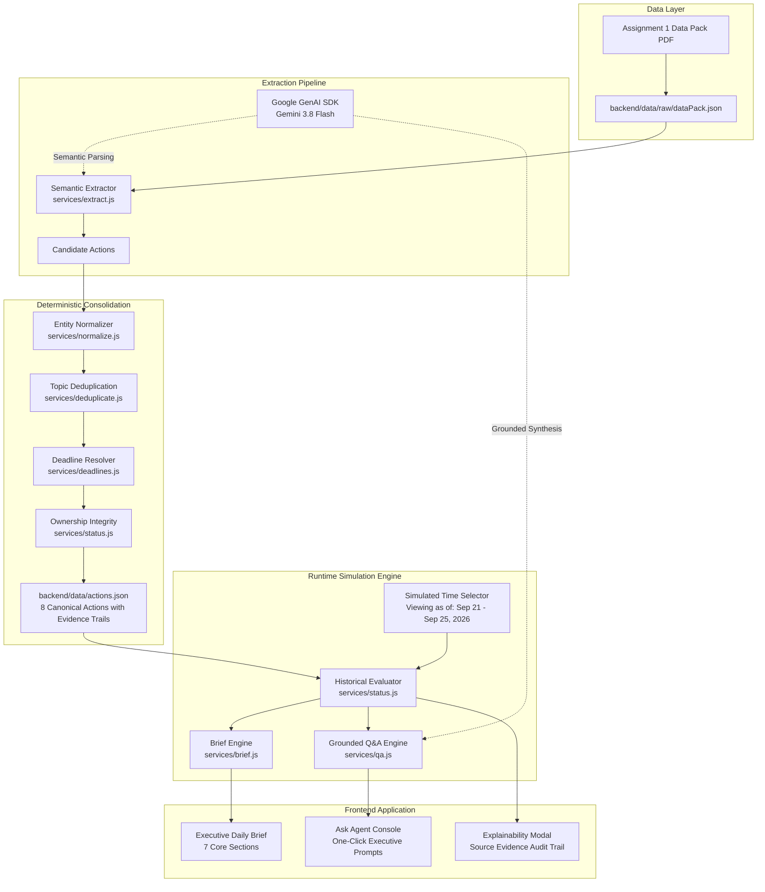

# AIONOS Executive Productivity Agent — System Architecture

This document describes the architectural design, data pipeline, decision boundaries, and implementation details of the Executive Productivity Agent built for **Arjun Malhotra (VP Sales)**.

---

## 1. Core Architectural Principle: Hybrid Pipeline

A core failure mode in naive agentic implementations is delegating exact business rules, timeline calculations, and deduplication logic entirely to an LLM. In an executive context, nondeterministic errors in deadlines, status, or task ownership destroy user trust.

To solve this, our system implements a **strictly layered hybrid pipeline**:
- **Semantic Understanding Layer (Gemini 3.8 Flash via `@google/genai`)**: Used where semantic parsing, natural language intent understanding, and grounded conversational Q&A are required.
- **Deterministic Business Logic Layer (JavaScript Services)**: Used where exact business rules, timeline math, canonical action deduplication, historical status transitions, and ownership enforcement are required.

```
MESSY BUSINESS INPUT (Emails, Meetings, Voice Notes, Calendar)
                      ↓
         Semantic Extraction (Gemini 3.8 Flash / Baseline)
                      ↓
         Deterministic Entity Normalization (normalize.js)
                      ↓
         Deterministic Topic-Based Deduplication (deduplicate.js)
                      ↓
         Deterministic Historical Deadline Resolution (deadlines.js)
                      ↓
         Deterministic Status & Ownership Resolution (status.js)
                      ↓
          Canonical Actions Store (backend/data/actions.json)
                      ↓
         Simulated Time Engine ("Viewing as of" Selector)
          ↙                                              ↘
Executive Daily Brief API                             Grounded Q&A API
(backend/services/brief.js)                         (backend/services/qa.js)
          ↓                                              ↓
Executive Dashboard (React)                        Ask Agent Interface (React)
```

---

## 2. End-to-End Mermaid Architecture Diagram



---

## 3. Pipeline Breakdown & Technical Defense

### 3.1 Raw Data Ingestion (`backend/data/raw/dataPack.json`)
Transcribes all artifacts from the Data Pack without modification:
- **People & Roles**: 6 entities (Arjun Malhotra [VP Sales], Neha Kapoor [Marketing Lead], Raghav Sethi [Ops Manager], Divya Rao [Finance], Priya Nair [Meridian Logistics], Facilities).
- **Leadership Sync Transcript**: Mon 21 Sep 9:00–9:35 AM.
- **Weekly Calendars**: Complete hourly schedule for Arjun, Neha, Raghav, and Divya across Sep 21–25, 2026.
- **Email Threads**: 5 distinct chronological conversations (5 emails each):
  1. Vendor List
  2. Q3 Campaign Deck
  3. Call Reschedule
  4. Expense Variance Report
  5. Mumbai Office Lease Renewal
- **Voice Notes**: 2 audio memo transcripts dictated by Arjun to himself (Mon 6:40 PM, Wed 8:15 AM).

### 3.2 Semantic Extraction (`backend/services/extract.js`)
- Interfaces with Gemini 3.8 Flash using the modern `@google/genai` SDK.
- Extracts candidate action items, explicit speaker intent, target deliverables, and source evidence citations.
- Incorporates a deterministic baseline extracted directly from the Data Pack ensuring 100% offline functionality, reproducible testing, and resilience against external API interruptions.

### 3.3 Entity Normalization (`backend/services/normalize.js`)
- Maps email addresses and nicknames to canonical person names (e.g., `raghav.sethi@veridian-corp.example` -> `Raghav Sethi`).
- Standardizes priority levels (`urgent`, `high`, `medium`, `low`) and categories (`sales_ops`, `marketing`, `finance`, `facilities_legal`, `client_relations`, `scheduled_event`).
- Ensures every evidence item preserves `sourceType`, `sourceId`, `timestamp`, `displayTime`, `from`, `to`, `evidence` (quote), and explanatory `note`.

### 3.4 Topic-Based Deduplication (`backend/services/deduplicate.js`)
- Solves the multi-mention problem: actions mentioned across meetings, email threads, voice notes, and calendars are merged into a single canonical record.
- Instead of relying on brittle string matching, clustering uses specific topic markers (`cluster-vendor-list`, `cluster-campaign-deck`, `cluster-mumbai-lease`, etc.).
- Compiles the chronological evidence trail so the action captures its entire lifecycle history.

### 3.5 Deterministic Deadline Resolution (`backend/services/deadlines.js`)
- Eliminates hallucinated deadlines by resolving relative terms against message timestamps within the fixed historical week (Sep 21–25, 2026):
  - `"end of day tomorrow"` relative to Mon 21 Sep -> `2026-09-22T17:00:00` (Tuesday EOD)
  - `"first thing tomorrow morning"` relative to Mon 21 Sep 5:40 PM -> `2026-09-22T09:00:00` (Tuesday morning)
  - `"tomorrow (Wednesday) morning for sure"` relative to Tue 22 Sep 6:30 PM -> `2026-09-23T12:00:00` (Wednesday morning)
  - `"Wednesday evening"` relative to Tue 22 Sep 9:40 AM -> `2026-09-23T18:00:00` (Wednesday 6:00 PM)
  - `"Thursday morning 9:30 AM"` relative to Wed 23 Sep 10:20 AM -> `2026-09-24T09:30:00` (Thursday 9:30 AM)
  - `"Friday, 25 September, end of day"` -> `2026-09-25T18:00:00` (Friday EOD)

### 3.6 Ownership Integrity (`backend/services/status.js`)
- **Strict Rule on Ambiguity**: If the source evidence states that ownership is unassigned or disputed, the system **never infers or fabricates an owner**.
- For the Mumbai Office Lease Renewal:
  - Divya thought Facilities normally handles it.
  - Facilities sent generic all-staff reminders without claiming sign-off.
  - Raghav twice followed up noting it is unowned.
  - Arjun explicitly instructed the team: "flag it, don't assume" and noted in Voice Note 1: "someone needs to own that, I don't think it's me."
  - **Outcome**: The system sets `owner: "Unclear"` and `status: "unclear"`.

### 3.7 Historical State & Status Resolution (`backend/services/status.js`)
Calculates status dynamically as a function of the simulated `asOf` timestamp:
1. Filters evidence known up to `asOf` (`timestamp <= asOf`).
2. Computes the active deadline established by the latest known evidence.
3. Computes active status:
   - `unclear`: Ownership unresolved (e.g. Mumbai lease).
   - `completed`: If `asOf >= action.completionTimestamp` (e.g. Divya delivering report on Wed 6:00 PM; Neha delivering deck on Thu 8:00 AM).
   - `overdue`: If not completed and `asOf > activeDeadline`.
   - `scheduled`: If it is a calendar session/call occurring in the future.
   - `waiting`: If Arjun is the recipient waiting for another owner to deliver.
   - `open`: If Arjun is the owner and deadline has not passed.

---

## 4. Grounded Executive Q&A Engine (`backend/services/qa.js`)

When a question is submitted:
1. Context Assembly: The current canonical actions evaluated as of the simulated timestamp are loaded.
2. Grounded Prompting: Gemini 3.8 Flash is given strict instructions to answer **ONLY** from the structured context and cite source quotes.
3. Grounding Guardrail: If an inquiry touches topics not present in the data pack, the engine outputs:
   > *"I could not determine that from the available source data."*
4. Resilient Fallback: If `GEMINI_API_KEY` is not present, a deterministic grounded QA engine evaluates the question, providing immediate, verified executive answers with citations.
